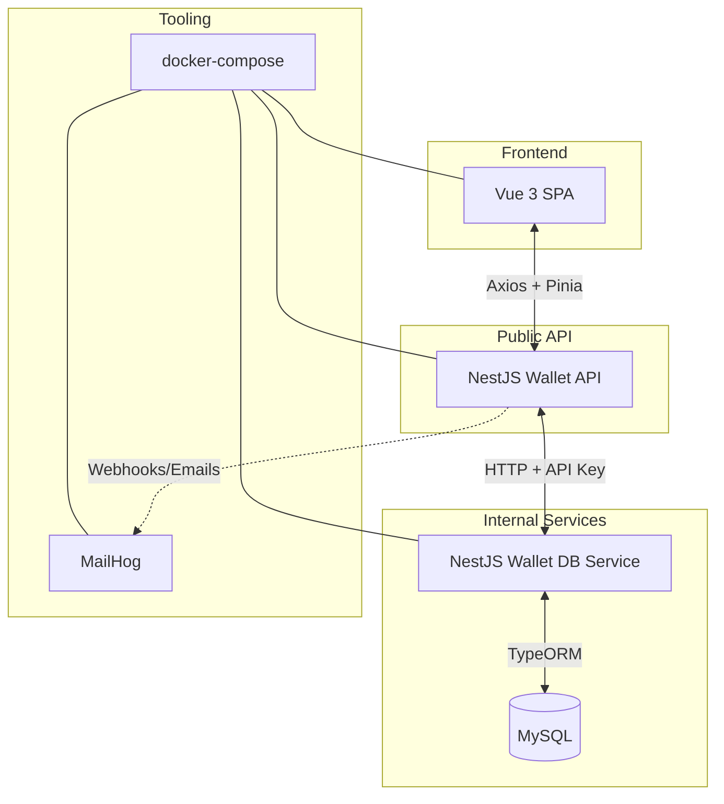

# EPayco Wallet Platform

Monorepo pnpm que orquesta la billetera virtual de EPayco. Incluye un frontend Vue 3 accesible, una API pública (BFF) en NestJS, un servicio interno de dominio con acceso a MySQL y artefactos de infraestructura para desarrollo local.

## Arquitectura



## Estructura de carpetas

- `apps/frontend`: SPA Vue 3 + Vite con Pinia, i18n y formularios accesibles.
- `services/wallet-api-service`: API pública (BFF) con Swagger, rate limiting y pruebas e2e.
- `services/wallet-db-service`: servicio interno orientado a dominio, gestiona MySQL y correo.
- `packages/shared`: contratos TypeScript compartidos entre servicios y frontend.
- `infra`: definición de docker-compose y scripts auxiliares.
- `services/wallet-api-service/postman`: colección y environment Postman listos para importar.

## Requisitos

- Node.js 20+
- pnpm 8+
- Docker + Docker Compose v2 (opcional pero recomendado)
- PowerShell 7+ (Windows) o Bash compatible

## Configuración de entorno

1. `pnpm install` en la raíz del monorepo.
2. Duplica cada `.env.example` y renómbralo como `.env` en la misma carpeta (`.env` raíz, `apps/frontend/.env`, `services/*/.env`).
3. Ajusta las variables si cambias puertos o credenciales.

### Variables principales

| Archivo | Clave | Descripción |
| --- | --- | --- |
| `.env` | `INTERNAL_API_KEY` | API key compartida entre servicios NestJS (debe coincidir en ambos). |
| `.env` | `MAILHOG_URL` | URL de MailHog para inspeccionar correos de tokens. |
| `apps/frontend/.env` | `VITE_API_BASE_URL` | URL base del BFF (por defecto `http://localhost:3000/api`). |
| `services/wallet-api-service/.env` | Ver `.env.example` | Configura puerto, prefijo, CORS y conexión al servicio interno. |
| `services/wallet-db-service/.env` | Ver `.env.example` | Configura conexión MySQL y parámetros de correo/token. |

## Inicio rápido con Docker Compose

Estas instrucciones levantan toda la plataforma usando la infraestructura de `infra/docker-compose.yml`.

```bash
pnpm install
cp .env.example .env                             # repite en apps/frontend y services/*
pnpm --filter @epayco/infra docker:up            # mysql + mailhog + redes
pnpm --filter @epayco/wallet-db-service migration:run
pnpm --filter @epayco/wallet-db-service seed:run # datos demo opcionales
pnpm --filter @epayco/wallet-db-service start:dev
pnpm --filter @epayco/wallet-api-service start:dev
pnpm --filter @epayco/frontend dev
```

- Swagger: `http://localhost:3000/api/docs`
- Frontend: `http://localhost:5173`
- MailHog: `http://localhost:8025`

## Configuración manual sin Docker

Si prefieres usar servicios locales gestionados manualmente:

1. Instala MySQL 8+ y crea la base de datos/usuario:

   ```sql
   CREATE DATABASE wallet CHARACTER SET utf8mb4 COLLATE utf8mb4_unicode_ci;
   CREATE USER 'wallet'@'%' IDENTIFIED BY 'wallet';
   GRANT ALL PRIVILEGES ON wallet.* TO 'wallet'@'%';
   FLUSH PRIVILEGES;
   ```

2. Actualiza `services/wallet-db-service/.env` con las credenciales y el host (`DB_HOST=localhost`, `DB_PORT=3306`).
3. Ejecuta migraciones y, opcionalmente, seeds:

   ```bash
   pnpm --filter @epayco/wallet-db-service migration:run
   pnpm --filter @epayco/wallet-db-service seed:run
   ```

4. Levanta los servicios en terminales separados:

   ```bash
   pnpm --filter @epayco/wallet-db-service start:dev
   pnpm --filter @epayco/wallet-api-service start:dev
   pnpm --filter @epayco/frontend dev
   ```

5. Para pruebas con correos, instala y ejecuta [MailHog](https://github.com/mailhog/MailHog/releases) (o ajusta `MAIL_HOST`, `MAIL_PORT`, `MAILHOG_URL` para tu SMTP). El flujo de confirmación de pagos funciona sin MailHog, pero no podrás capturar los tokens.

## Colecciones Postman

Importa los archivos en `services/wallet-api-service/postman/`:

- `epayco-wallet-api.postman_collection.json`
- `epayco-wallet-local.postman_environment.json`

La colección cubre registro, recarga, pagos (inicio/confirmación), balance y healthcheck.

## Pruebas

- Frontend: `pnpm --filter @epayco/frontend test`
- API pública unit tests: `pnpm --filter @epayco/wallet-api-service test`
- API pública e2e (Supertest): `pnpm --filter @epayco/wallet-api-service test:e2e`
- Servicio interno: `pnpm --filter @epayco/wallet-db-service test`

> Nota: en entornos sin `node`, pnpm devolverá `node: not found`; instala Node.js y vuelve a ejecutar.

## Convenciones

Consulta `docs/contributing.md` para detalles completos.

- **Commits:** sigue [Conventional Commits](https://www.conventionalcommits.org/) (ejemplo: `feat(api): add wallet e2e tests`).
- **Changelog:** los cambios significativos se documentan en `CHANGELOG.md`.
- **CI/CD:** todos los scripts respetan ESLint, Prettier y pruebas unitarias/e2e antes de desplegar.
