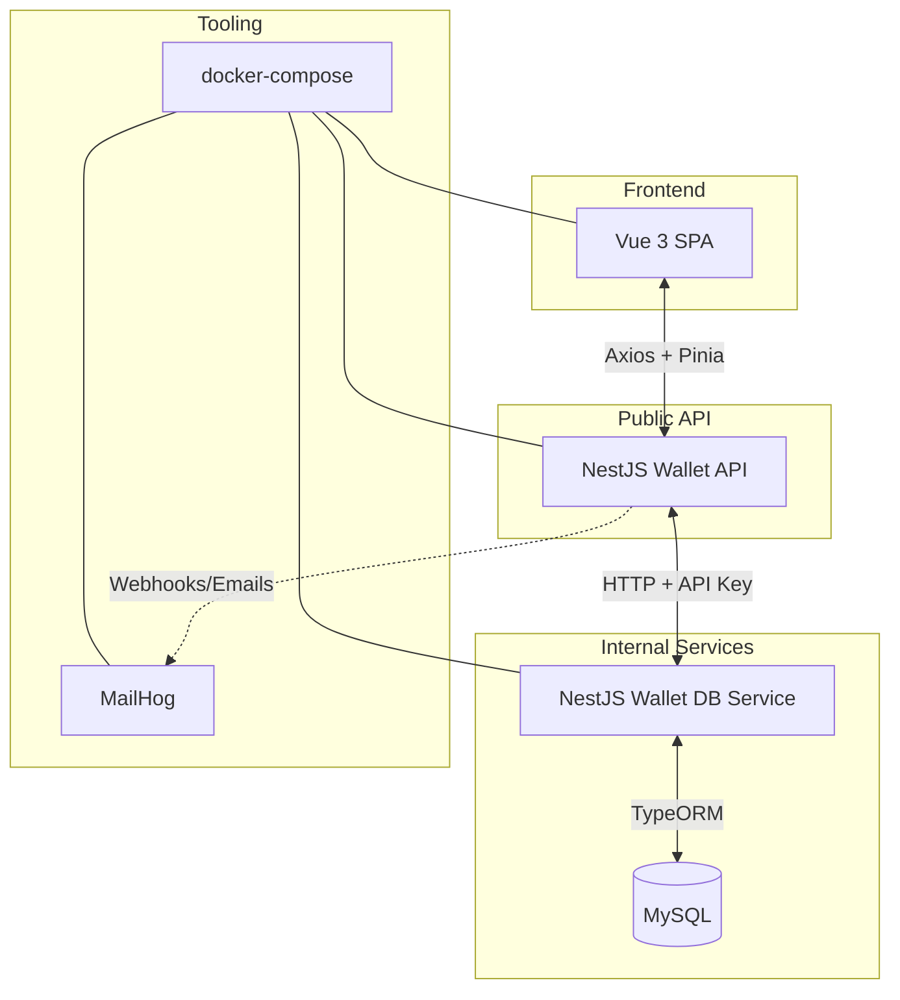

# EPayco Wallet Platform

Monorepo pnpm que orquesta la billetera virtual de EPayco. Incluye un frontend Vue 3 accesible, una API pública (BFF) en NestJS, un servicio interno de dominio con acceso a MySQL y artefactos de infraestructura para desarrollo local.

## Arquitectura



## Estructura de carpetas

- `apps/frontend`: SPA Vue 3 + Vite con Pinia, i18n y formularios accesibles.
- `services/wallet-api-service`: API pública (BFF) con Swagger, rate limiting y pruebas e2e.
- `services/wallet-db-service`: servicio interno orientado a dominio, gestiona MySQL y correo.
- `packages/shared`: contratos TypeScript compartidos entre servicios y frontend.
- `infra`: definición de docker-compose y scripts auxiliares.
- `services/wallet-api-service/postman`: colección y environment Postman listos para importar.

## Requisitos

- Node.js 20+
- pnpm 8+
- Docker + Docker Compose v2 (opcional pero recomendado)
- PowerShell 7+ (Windows) o Bash compatible

## Configuración de entorno

1. `pnpm install` en la raíz del monorepo.
2. Duplica cada `.env.example` y renómbralo como `.env` en la misma carpeta (`.env` raíz, `apps/frontend/.env`, `services/*/.env`).
3. Ajusta las variables si cambias puertos o credenciales.

### Variables principales

| Archivo | Clave | Descripción |
| --- | --- | --- |
| `.env` | `INTERNAL_API_KEY` | API key compartida entre servicios NestJS (debe coincidir en ambos). |
| `.env` | `MAILHOG_URL` | URL de MailHog para inspeccionar correos de tokens. |
| `apps/frontend/.env` | `VITE_API_BASE_URL` | URL base del BFF (por defecto `http://localhost:3000/api`). |
| `services/wallet-api-service/.env` | Ver `.env.example` | Configura puerto, prefijo, CORS y conexión al servicio interno. |
| `services/wallet-db-service/.env` | Ver `.env.example` | Configura conexión MySQL y parámetros de correo/token. |

## Inicio rápido con Docker Compose

Estas instrucciones levantan toda la plataforma usando la infraestructura de `infra/docker-compose.yml`.

```bash
pnpm install
cp .env.example .env                             # repite en apps/frontend y services/*
pnpm --filter @epayco/infra docker:up            # mysql + mailhog + redes
pnpm --filter @epayco/wallet-db-service migration:run
pnpm --filter @epayco/wallet-db-service seed:run # datos demo opcionales
pnpm --filter @epayco/wallet-db-service start:dev
pnpm --filter @epayco/wallet-api-service start:dev
pnpm --filter @epayco/frontend dev
```

- Swagger: `http://localhost:3000/api/docs`
- Frontend: `http://localhost:5173`
- MailHog: `http://localhost:8025`

## Configuración manual sin Docker

Si prefieres usar servicios locales gestionados manualmente (como WampServer en Windows):

### Prerrequisitos para Windows con WampServer

1. **WampServer instalado y funcionando** con MySQL 8+ y phpMyAdmin
2. **Configurar PATH de MySQL** (temporal para la sesión actual):
   ```powershell
   $env:PATH += ";c:\wamp64\bin\mysql\mysql9.1.0\bin"
   ```
   O agregar permanentemente `c:\wamp64\bin\mysql\mysql9.1.0\bin` a las variables de entorno del sistema.

### Configuración de la base de datos

1. **Crear la base de datos y usuario** (usando MySQL CLI o phpMyAdmin):

   **Opción A - MySQL CLI:**
   ```bash
   mysql -u root -p -e "CREATE DATABASE wallet CHARACTER SET utf8mb4 COLLATE utf8mb4_unicode_ci;"
   ```

   **Opción B - phpMyAdmin:**
   - Accede a `http://localhost/phpmyadmin`
   - Crea una nueva base de datos llamada `wallet`
   - Configura charset: `utf8mb4` y collation: `utf8mb4_unicode_ci`

   **Verificar usuario wallet** (el usuario debería existir desde configuraciones previas):
   ```sql
   CREATE USER 'wallet'@'%' IDENTIFIED BY 'wallet';
   GRANT ALL PRIVILEGES ON wallet.* TO 'wallet'@'%';
   FLUSH PRIVILEGES;
   ```

### Configuración de servicios

2. **Actualizar configuración de servicios:**
   - En `services/wallet-db-service/.env`:
     - `DB_HOST=localhost`
     - `DB_PORT=3306`
     - `MAIL_HOST=localhost` (o tu servidor SMTP local)
     - `MAIL_PORT=25` (o el puerto de tu servidor SMTP)

### Ejecutar migraciones y seeds

3. **Ejecutar migraciones y seeds:**

   ```bash
   pnpm --filter @epayco/wallet-db-service migration:run
   pnpm --filter @epayco/wallet-db-service seed:run
   ```

### Iniciar servicios

4. **Levantar los servicios en terminales separados:**

   ```bash
   pnpm --filter @epayco/wallet-db-service start:dev
   pnpm --filter @epayco/wallet-api-service start:dev
   pnpm --filter @epayco/frontend dev
   ```

### Configuración de correos (opcional)

5. **Para pruebas con correos:**
   - **Opción A:** Instala y ejecuta [MailHog](https://github.com/mailhog/MailHog/releases) y ajusta `MAIL_HOST=localhost`, `MAIL_PORT=1025`
   - **Opción B:** Configura tu servidor SMTP local en las variables `MAIL_HOST`, `MAIL_PORT`, `MAIL_USER`, `MAIL_PASSWORD`
   - **Nota:** El flujo de confirmación de pagos funciona sin configuración de correo, pero no podrás capturar los tokens de confirmación.

### Verificación

Después de completar la configuración, verifica que todo funcione:
- **Base de datos:** Revisa las tablas creadas en phpMyAdmin (`http://localhost/phpmyadmin`)
- **API:** `http://localhost:3001/health` (wallet-db-service)
- **Swagger:** `http://localhost:3000/api/docs` (wallet-api-service)
- **Frontend:** `http://localhost:5173`

## Colecciones Postman

Importa los archivos en `services/wallet-api-service/postman/`:

- `epayco-wallet-api.postman_collection.json`
- `epayco-wallet-local.postman_environment.json`

La colección cubre registro, recarga, pagos (inicio/confirmación), balance y healthcheck.

## Scripts

- `pnpm dev`: ejecuta los scripts dev de todos los paquetes en paralelo para un flujo de desarrollo rapido.
- `pnpm build`: compila todos los paquetes respetando las dependencias internas.
- `pnpm lint`: ejecuta los linters configurados en cada paquete.
- `pnpm test`: lanza la suite de pruebas de cada paquete.

## Pruebas

- Frontend: `pnpm --filter @epayco/frontend test`
- API pública unit tests: `pnpm --filter @epayco/wallet-api-service test`
- API pública e2e (Supertest): `pnpm --filter @epayco/wallet-api-service test:e2e`
- Servicio interno: `pnpm --filter @epayco/wallet-db-service test`

> Nota: en entornos sin `node`, pnpm devolverá `node: not found`; instala Node.js y vuelve a ejecutar.

## Convenciones

Consulta `docs/contributing.md` para detalles completos.

- **Commits:** sigue [Conventional Commits](https://www.conventionalcommits.org/) (ejemplo: `feat(api): add wallet e2e tests`).
- **Changelog:** los cambios significativos se documentan en `CHANGELOG.md`.
- **CI/CD:** todos los scripts respetan ESLint, Prettier y pruebas unitarias/e2e antes de desplegar.

## Solución de problemas

### Errores comunes con Docker Compose

#### Error: `npm error EEXIST: file already exists /usr/local/bin/pnpm`

**Síntoma:** Al ejecutar `pnpm --filter @epayco/infra docker:up`, el build falla con:
```
npm error code EEXIST
npm error path /usr/local/bin/pnpm
npm error EEXIST: file already exists
```

**Causa:** Conflicto entre `corepack enable` y la instalación global de pnpm en la imagen base de Node.js.

**Solución:** Ya está corregido en los Dockerfiles del proyecto. Si encuentras este error en versiones anteriores, agrega `--force` al comando de instalación de pnpm:
```dockerfile
RUN corepack enable && npm i -g pnpm@8.15.4 --force
```

#### Error: `Context transfer too large`

**Síntoma:** El build de Docker es muy lento o falla por transferir demasiados archivos.

**Solución:** 
1. Verifica que `.dockerignore` esté presente en cada servicio/app
2. Asegúrate de que `node_modules` esté incluido en `.dockerignore`
3. Ejecuta `docker system prune` para limpiar caché de Docker

#### Error: `Port already in use`

**Síntoma:** Los contenedores no pueden iniciarse porque los puertos están ocupados.

**Solución:**
1. Detén otros servicios que usen los mismos puertos (3000, 3001, 5173, 3306, 8025)
2. O modifica los puertos en `infra/docker-compose.yml` y actualiza las variables de entorno correspondientes

#### Error: `Database connection failed`

**Síntoma:** Los servicios no pueden conectarse a MySQL.

**Solución:**
1. Verifica que el contenedor de MySQL esté ejecutándose: `docker ps`
2. Espera unos segundos más para que MySQL termine de inicializarse
3. Verifica las credenciales en los archivos `.env`
4. Reinicia los contenedores: `docker compose down && docker compose up -d`

#### Error: `vue-tsc` build failure

**Síntoma:** El build del frontend falla con errores como "Search string not found" en `vue-tsc.js` durante `vue-tsc --noEmit && vite build`.

**Causa:** Incompatibilidad entre versiones de `vue-tsc` y TypeScript. Versiones antiguas de `vue-tsc` (como 1.8.x) pueden tener problemas con TypeScript 5.4+.

**Solución:**
1. Actualiza `vue-tsc` a una versión compatible (2.0.29 o superior):
   ```bash
   # En el directorio apps/frontend
   pnpm add -D vue-tsc@^2.0.29
   ```
2. Actualiza el lockfile:
   ```bash
   pnpm install
   ```
3. Limpia la caché de Docker y reconstruye:
   ```bash
   docker system prune -f
   pnpm --filter @epayco/infra docker:up
   ```

### Comandos útiles para diagnóstico

```bash
# Ver logs de todos los contenedores
docker compose logs -f

# Ver logs de un servicio específico
docker compose logs -f wallet-api-service

# Verificar estado de contenedores
docker ps

# Limpiar caché de Docker (si hay problemas de build)
docker system prune -a

# Reconstruir contenedores desde cero
docker compose down
docker compose build --no-cache
docker compose up -d
```
